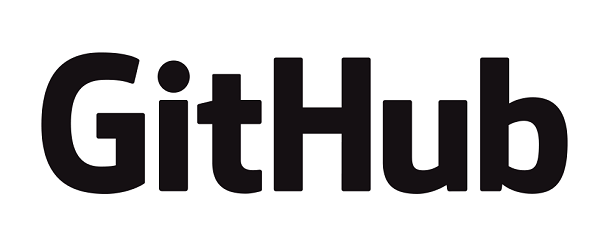

# Blog Posts
| Blog Site  | Link| Date |
| ------------- | ------------- | ------------- |
| **AWS Blogs** | [How to deploy CDK v2 to an account that requires boundary policies](https://aws.amazon.com/blogs/mt/how-to-deploy-cdk-v2-to-an-account-that-requires-boundary-policies/)  | October, 2022|
| **CentOs Blogs**  | [Cloud In A Box: CentOS OpenStack Remix](https://blog.centos.org/2015/07/cloud-in-a-box-centos-openstack-remix/)   | July, 2015|

# Repositories

|Name|Description|Language|
| ------------- | ------------- | ------------- |
|[CDKV2 BootStrap](https://github.com/aws-samples/aws-cdk-v2-bootstrap)|This script adds a specified AWS IAM boundary policy to each AWS IAM role object (AWS::IAM::Role) in a cloudformation template file. This is useful, when working with AWS CDK to deploy infrastructure to AWS accounts, where the organization policies mandate, that each new user/role should have an attached permissions boundary policy.|Python|
|[OpenStack Anaconda](https://github.com/asadpiz/org_centos_cloud)|This is an addon that enables installation/setup of OpenStack during CentOS installation (Background & Motivation)|Python|

# Social

)
